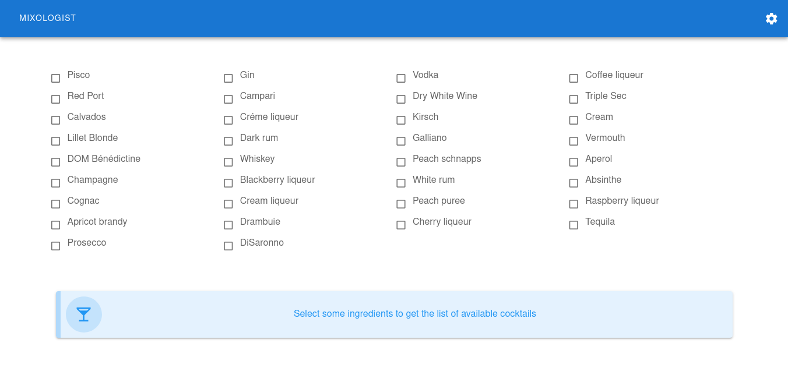

**Mixology**

Mixology is a web-ui to control (via MQTT) multiple relay-based peristaltic
pumps, in order to setup a homemade automatic cocktail dispenser.

The relays must be setup with any tasmota-enabled device. Wich makes it
possible tu use out-of-the-box supported tasmota relays, I really would like to
try one like `this one <https://templates.blakadder.com/athom_R08.html>`_ but I
already made my selfmade 8-relay board, and that's what I'm currently using.
Just set it up with the relays against a number of peristaltic pumps, and
connect them to your alcoholic beverages.

|pypi| |release| |downloads| |python_versions| |pypi_versions| |coverage| |actions|

.. |pypi| image:: https://img.shields.io/pypi/l/mixologist
.. |release| image:: https://img.shields.io/librariesio/release/pypi/mixologist
.. |downloads| image:: https://img.shields.io/pypi/dm/mixologist
.. |python_versions| image:: https://img.shields.io/pypi/pyversions/mixologist
.. |pypi_versions| image:: https://img.shields.io/pypi/v/mixologist
.. |actions| image:: https://github.com/XayOn/mixologist/workflows/CI%20commit/badge.svg
    :target: https://github.com/XayOn/mixologist/actions

Installation
------------

This software is available on `Pypi <https://pypi.org/project/mixologist/>`_, you
can install it directly with pip::

        pip install mixologist uvicorn

After that, you should run it with uvicorn::

        uvicorn mixologist:app

You can also use docker, with a docker-compose like this one.

.. code:: yaml

    version: "3.3"
    services:
      mixologist:
        image: xayon/mixologist
        restart: always
        environment:
          - BASE_URL=/mixologist

The BASE_URL variable is useful on reverse-proxy setups.

Usage
-----

Simply access the webui. Go to the settings menu (gear icon), setup your MQTT
uri as you have in your tasmotas, restart the service and go back to the
settings menu. All your tasmotas and thei'r relays will automatically appear
there, and you can configure the pump troughput and alcohol type.

Afterwards, simply select your available alcohols, it will filter the closest
cocktails, and click "Prepare" on any of them.

TODO
----

Upload some videos. Improve my personal ("demo") setup, as it currently is too
make-ry for my taste. I'm having troubles with two of my six peristaltic
pumps, maybe a list of recommended hardware? Maybe even a simple schematic for
the relay + pumps.
